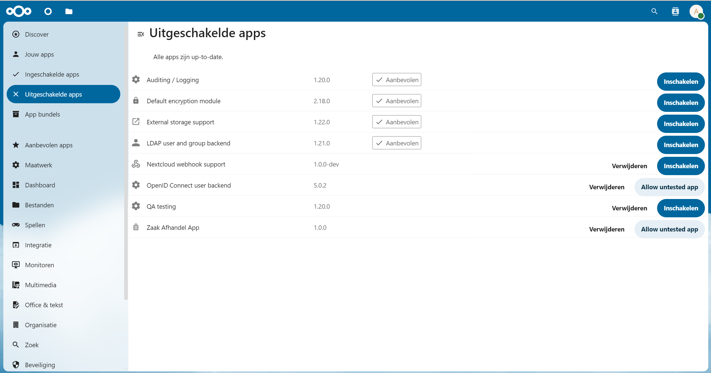

## Installatie
Volg voor het het locaal instaleren van nextcloud de handleiding op https://cloud.nextcloud.com/s/iyNGp8ryWxc7Efa?dir=undefined&path=%2F1%20Setting%20up%20a%20development%20environment%2FTutorial%20for%20Windows&openfile=7087340

!let op! installatie via de nextcloud handleing plaats de code in je ubuntu vm (wml) waarmee die niet vanzelf in windows file explorer terug komt. Wil je je WSL bekijken via file explor tik dan \\wsl$ in de adres balkd

1. Navigeer binnen de nextcloud folder op je wsl naar de workspace/server/apps-extra map, als je de commandline interface nog open hebt staan kan dat via cd workspace/server/apps-extra
2. Clone deze repository naar binnen via het commando git clone https://github.com/ConductionNL/dsonextcloud
3. Draai vervolgens de commando's `npm i` en daarna `npm run dev` via de commandlin interaface

## Code bekijken
\\wsl.localhost\Ubuntu-20.04\home\rubenlinde\nextcloud-docker-dev\workspace\server\apps-extra

## Upen
docker-compose up nextcloud proxy

Clone de dsonextcloud app in de folder  C:\path...\nextcloud-docker-dev\workspace\server\apps-extra en start de nextcloud server op.
Open ondertussen een terminal in de dsonextcloud folder en run `npm i` en daarna `npm run dev`.
Als de server gestart is log dan in met het standaard admin account (name: admin, psw: admin)
ga naar apps afb1, en schakel de Zaak Afhandel App in afb2.
Wacht totdat de app zichtbaar is in de navigatie balk en klik op de app afb3.
